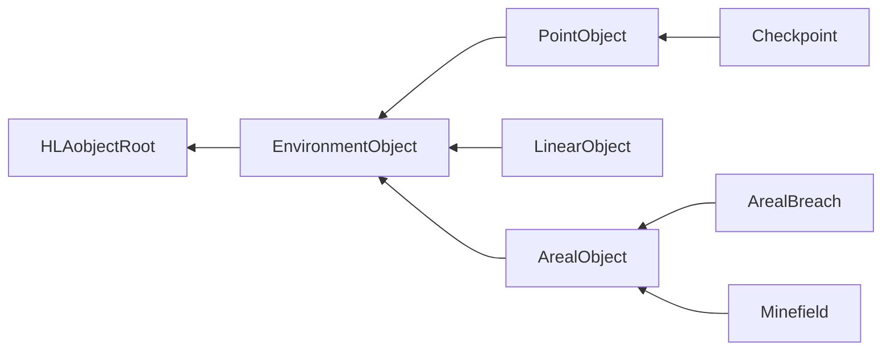

# NETN-SE
|Version| Date| Dependencies|
|---|---|---|
|2.0|2023-03-30|NETN-BASE, RPR-SE|

The purpose of the NATO Education and Training Network Synthetic Environment Module (NETN-SE) is to provide a standard way to exchange simulation data for objects in the synthetic environment other than entities such as Units or Platforms.

The specification is based on IEEE 1516 High Level Architecture (HLA) Object Model Template (OMT) and is primarily intended to support interoperability in a federated simulation (federation) based on HLA. A Federation Object Model (FOM) Module is used to specify how data is represented and exchanged in the federation. The NETN-ORG FOM module is available as an XML file for use in HLA-based federations.

NETN-SE extends the RPR-SE concerning:

* Checkpoints
* Minefields and generic obstacles
* Breaches of minefields and generic obstacles

## Object Classes

Note that inherited and dependency attributes are not included in the description of object classes.

### EnvironmentObject

A base class of environment point, linear, or areal object classes.

|Attribute|Datatype|Semantics|
|---|---|---|
|Name|HLAunicodeString|Optional. Name of the EnvironmentObject.|
|SymbolId|SymbolIdentifier|Optional. A symbol identifier represented as a string.|
|Status|ActiveStatusEnum8|Optional. Specifies if the EnvironmentObject is considered active in the simulation. Inactive object should not affect other simulation models. Default value is 1 (Active).|
|DamageState|DamageStatusEnhancedEnum32|Optional. The damage state of an EnvironmentObject. Default value is 0 (NoDamage).|
|Comment|HLAunicodeString|Optional. A descriptive text comment.|
|HostObject|UUID|Required when using Breach/Burst objects. The unique ID of host object.|

### PointObject

A synthetic environment object that is geometrically anchored to the terrain with a single point.

|Attribute|Datatype|Semantics|
|---|---|---|
|Radius|MeterFloat64|Optional. Radius of point object.|

### Checkpoint

A CheckPoint defines a location where simulated entities' ground movement should stop and wait a specified time before continuing on their route.

|Attribute|Datatype|Semantics|
|---|---|---|
|DelayTime|TimeMillisecondInt64|Required. The time that an entity shall wait at the checkpoint before passing. The time is a nominal value; federates can use this for modifying delay time for different types of entities, e.g. add or subtract a value or multiply with a type depending factor.|

### LinearObject

A synthetic environment object that has size and an orientation and is geometrically anchored to the terrain with one point.

|Attribute|Datatype|Semantics|
|---|---|---|
|Points|WorldLocationPath|Required. A path with at least 2 points expressed as WorldLocations.|

### ArealBreach

An area within an obstacle that has been cleared and now allows for the movement of simulated entities.

### Minefield

An obstacle with a density of mines used to prevent the movement of other forces.

|Attribute|Datatype|Semantics|
|---|---|---|
|Density|QuantityFloat32|Required. Number of mines per hectare (ha). (1 ha = 10000 m2 = 2.4711 acres)|
