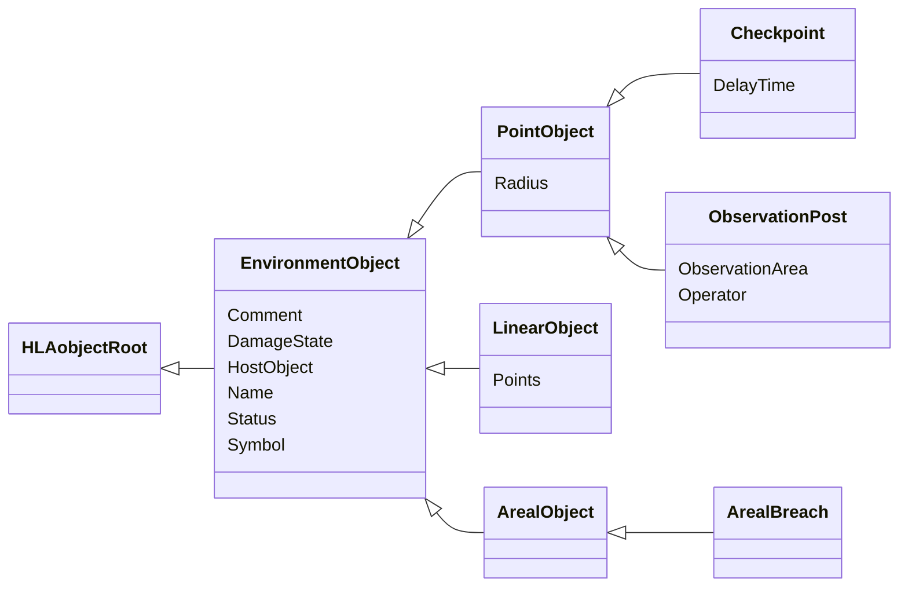
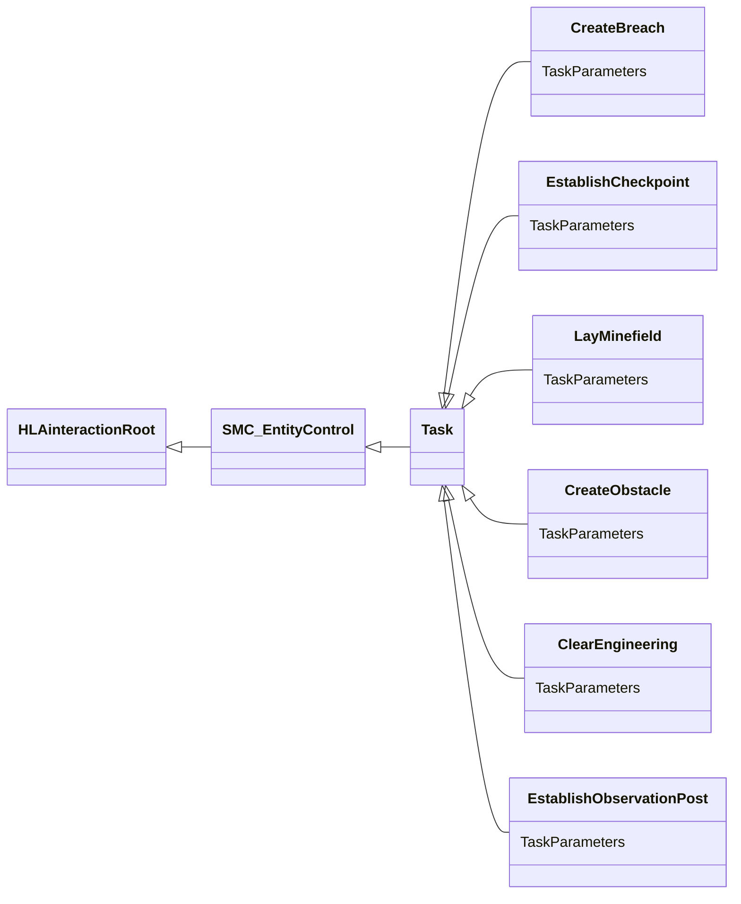

# NETN-SE
|Version| Date| Dependencies|
|---|---|---|
|2.0|2023-11-19|RPR-SE, NETN-ETR|

The purpose of the NATO Education and Training Network Synthetic Environment Module (NETN-SE) is to provide a standard way to exchange simulation data for objects in the synthetic environment other than simulated entities such as `Platform` or `AggregateEntity` objects.

The specification is based on IEEE 1516 High Level Architecture (HLA) Object Model Template (OMT) and supports interoperability in a federated simulation (federation) based on HLA.

NETN-SE defines:
* Establishing and representing checkpoints
* Laying and breaching minefields and generic obstacles

## Object Classes

### EnvironmentObject

A base class of environment point, linear, or areal object classes.

|Attribute|Datatype|Semantics|
|---|---|---|
|Comment|HLAunicodeString|Optional. A descriptive text comment.|
|DamageState|DamageStatusEnhancedEnum32|Optional. The damage state of an EnvironmentObject. The default value is 0 (NoDamage).|
|HostObject|UUID|Optional. Reference to the host object. Required when using Breach/Burst objects.|
|Name|HLAunicodeString|Optional. A name of the EnvironmentObject.|
|Status|ActiveStatusEnum8|Optional. Specifies if the EnvironmentObject is considered active in the simulation. An inactive object should not affect other simulation models. The default value is 1 (Active).|
|Symbol|SymbolStruct|Optional. A symbol identifier.|

### PointObject

A synthetic environment object that is geometrically anchored to the terrain with a single point.

|Attribute|Datatype|Semantics|
|---|---|---|
|Comment|HLAunicodeString|Optional. A descriptive text comment.|
|DamageState|DamageStatusEnhancedEnum32|Optional. The damage state of an EnvironmentObject. The default value is 0 (NoDamage).|
|HostObject|UUID|Optional. Reference to the host object. Required when using Breach/Burst objects.|
|Name|HLAunicodeString|Optional. A name of the EnvironmentObject.|
|Radius|MeterFloat64|Optional. The radius of the point object.|
|Status|ActiveStatusEnum8|Optional. Specifies if the EnvironmentObject is considered active in the simulation. An inactive object should not affect other simulation models. The default value is 1 (Active).|
|Symbol|SymbolStruct|Optional. A symbol identifier.|

### Checkpoint

A CheckPoint defines a location where simulated entities' ground movement should stop and wait a specified time before continuing their route.

|Attribute|Datatype|Semantics|
|---|---|---|
|Comment|HLAunicodeString|Optional. A descriptive text comment.|
|DamageState|DamageStatusEnhancedEnum32|Optional. The damage state of an EnvironmentObject. The default value is 0 (NoDamage).|
|DelayTime|TimeMillisecondInt64|Required. The time that an entity shall wait at the checkpoint before passing. The time is a nominal value; models can use this for modifying delay time for different types of entities, e.g. add or subtract a value or multiply with a factor dependent on the simulation entity type.|
|HostObject|UUID|Optional. Reference to the host object. Required when using Breach/Burst objects.|
|Name|HLAunicodeString|Optional. A name of the EnvironmentObject.|
|Radius|MeterFloat64|Optional. The radius of the point object.|
|Status|ActiveStatusEnum8|Optional. Specifies if the EnvironmentObject is considered active in the simulation. An inactive object should not affect other simulation models. The default value is 1 (Active).|
|Symbol|SymbolStruct|Optional. A symbol identifier.|

### ObservationPost

A ObservationPost defines a location where a simulated entity can observe an area.

|Attribute|Datatype|Semantics|
|---|---|---|
|Comment|HLAunicodeString|Optional. A descriptive text comment.|
|DamageState|DamageStatusEnhancedEnum32|Optional. The damage state of an EnvironmentObject. The default value is 0 (NoDamage).|
|HostObject|UUID|Optional. Reference to the host object. Required when using Breach/Burst objects.|
|Name|HLAunicodeString|Optional. A name of the EnvironmentObject.|
|ObservationArea|WorldLocationStructLengthlessArray|Optional. The area to be observed.|
|Operator|UUID|Required. Reference to the unit operating this observation post.|
|Radius|MeterFloat64|Optional. The radius of the point object.|
|Status|ActiveStatusEnum8|Optional. Specifies if the EnvironmentObject is considered active in the simulation. An inactive object should not affect other simulation models. The default value is 1 (Active).|
|Symbol|SymbolStruct|Optional. A symbol identifier.|

### LinearObject

A synthetic environment object that has size and an orientation and is geometrically anchored to the terrain with one point.

|Attribute|Datatype|Semantics|
|---|---|---|
|Comment|HLAunicodeString|Optional. A descriptive text comment.|
|DamageState|DamageStatusEnhancedEnum32|Optional. The damage state of an EnvironmentObject. The default value is 0 (NoDamage).|
|HostObject|UUID|Optional. Reference to the host object. Required when using Breach/Burst objects.|
|Name|HLAunicodeString|Optional. A name of the EnvironmentObject.|
|Points|LocationStructArray|Required. A path with at least 2 locations.|
|Status|ActiveStatusEnum8|Optional. Specifies if the EnvironmentObject is considered active in the simulation. An inactive object should not affect other simulation models. The default value is 1 (Active).|
|Symbol|SymbolStruct|Optional. A symbol identifier.|

### ArealBreach

A cleared area within an obstacle allows simulated entities to move through the obstacle.

|Attribute|Datatype|Semantics|
|---|---|---|
|Comment|HLAunicodeString|Optional. A descriptive text comment.|
|DamageState|DamageStatusEnhancedEnum32|Optional. The damage state of an EnvironmentObject. The default value is 0 (NoDamage).|
|HostObject|UUID|Optional. Reference to the host object. Required when using Breach/Burst objects.|
|Name|HLAunicodeString|Optional. A name of the EnvironmentObject.|
|Status|ActiveStatusEnum8|Optional. Specifies if the EnvironmentObject is considered active in the simulation. An inactive object should not affect other simulation models. The default value is 1 (Active).|
|Symbol|SymbolStruct|Optional. A symbol identifier.|

## Interaction Classes

### CreateBreach

Requests a simulated entity to create a breach or passage on a breachable engineering object.

|Parameter|Datatype|Semantics|
|---|---|---|
|TaskParameters|CreateBreachTaskStruct|Required: Task parameters.|

### EstablishCheckpoint

Requests a simulated entity to establish a checkpoint.

|Parameter|Datatype|Semantics|
|---|---|---|
|TaskParameters|EstablishCheckpointTaskStruct|Required: Task parameters.|

### LayMinefield

Requests a simulated entity to lay a minefield within a specified area and amount of mines.

|Parameter|Datatype|Semantics|
|---|---|---|
|TaskParameters|LayMinefieldTaskStruct|Required: Task parameters.|

### CreateObstacle

Requests a simulated entity to create an obstacle within the given area. The tasked entity should be within a certain distance (tolerance specified in the federation agreement) of one of the points of the geometry.

|Parameter|Datatype|Semantics|
|---|---|---|
|TaskParameters|CreateObstacleTaskStruct|Required: Task parameters.|

### ClearEngineering

Requests a simulated entity to clear/remove an engineering object. The clearing activity's duration may depend on the entity's model.

|Parameter|Datatype|Semantics|
|---|---|---|
|TaskParameters|ClearEngineeringTaskStruct|Required: Task parameters.|

### EstablishObservationPost

Requests a simulated entity to establish a observation post.

|Parameter|Datatype|Semantics|
|---|---|---|
|TaskParameters|EstablishObservationPostTaskStruct|Required. Task parameters.|

## Datatypes

Note that only datatypes defined in this FOM Module are listed below. Please refer to FOM Modules on which this module depends for other referenced datatypes.

### Overview
|Name|Semantics|
|---|---|
|ClearEngineeringTaskStruct|Task parameters.|
|CreateBreachTaskStruct|Task parameters.|
|CreateObstacleTaskStruct|Task parameters.|
|EngineeringTaskStruct|Task parameters.|
|EntityControlActionEnum|Control actions for entities.|
|EstablishCheckpointTaskStruct|Task parameters.|
|EstablishObservationPostTaskStruct|Task parameters.|
|LayMinefieldTaskStruct|Task parameters.|
|TaskDefinitionVariantRecord|Variant record for task definition data.|
|TaskProgressVariantRecord|Variant record for task progress data.|
        
### Enumerated Datatypes
|Name|Representation|Semantics|
|---|---|---|
|EntityControlActionEnum|HLAinteger32BE|Control actions for entities.|
        
### Fixed Record Datatypes
|Name|Fields|Semantics|
|---|---|---|
|ClearEngineeringTaskStruct|EngineeringObjectId, Duration|Task parameters.|
|CreateBreachTaskStruct|EngineeringTask, EngineeringObject, Area|Task parameters.|
|CreateObstacleTaskStruct|EngineeringTask, Area|Task parameters.|
|EngineeringTaskStruct|EngineeringObjectId, Name, Duration|Task parameters.|
|EstablishCheckpointTaskStruct|EngineeringTask, Location, Radius, DelayTime|Task parameters.|
|EstablishObservationPostTaskStruct|EngineeringTask, Location|Task parameters.|
|LayMinefieldTaskStruct|EngineeringTask, MineType, MineCount, Area|Task parameters.|
        
### Variant Record Datatypes
|Name|Discriminant (Datatype)|Alternatives|Semantics|
|---|---|---|---|
|TaskDefinitionVariantRecord|TaskType (EntityControlActionEnum)|ClearEngineering, LayMinefield, CreateBreach, EstablishCheckpoint, CreateObstacle, EstablishObservationPost|Variant record for task definition data.|
|TaskProgressVariantRecord|TaskType (EntityControlActionEnum)|ElapsedEngineeringTime|Variant record for task progress data.|
    